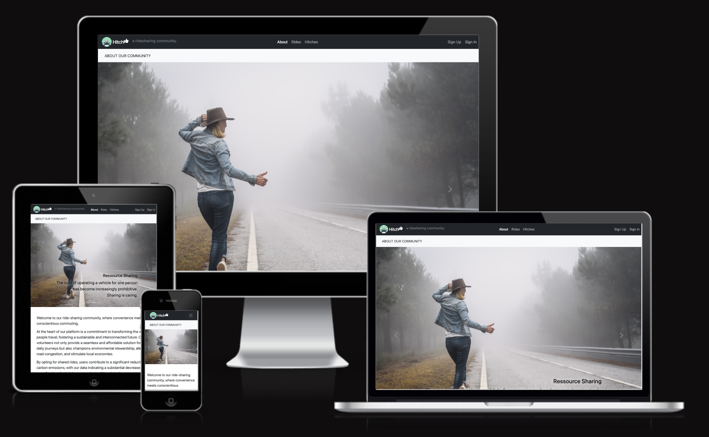
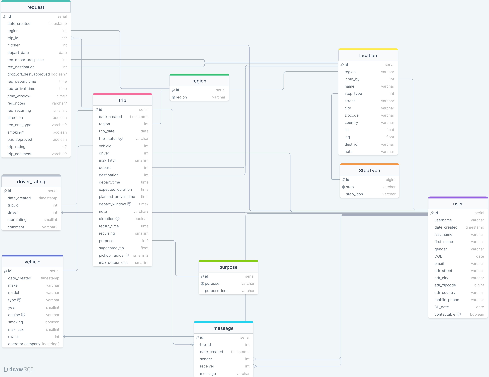
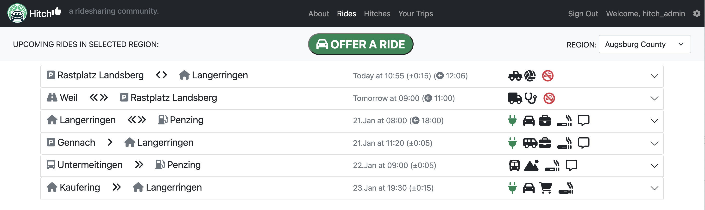

# HITCH - A Ridesharing Community

Find it on GitHub: <a href="https://github.com/A-Hoenig/Hitch">HITCH</a>

## CONTENTS

<!-- TABLE OF CONTENTS -->

  
Table of Contents

  <ol>
    <li><a href="#about-the-project">About The Project</a></li>
    <li><a href="#user-stories">User Stories</a></li>
    <li><a href="#design">Design</a></li>
    <li><a href="#technologies-used">Technologies</a></li>
    <li><a href="#evaluation-and-assessment">Project Evaluation</a></li>
    <li><a href="#repository">Deployment</a></li>
    <li><a href="#future-development">Future Development</a></li>
    <li><a href="#license">License</a></li>
    <li><a href="#testing">Testing</a></li>
    <li><a href="#contact">Contact</a></li>
    <li><a href="#acknowledgments">Acknowledgments</a></li>
  </ol>

### Built With
* [https://www.gitpod.io/](GitPod)

<!-- ABOUT THE PROJECT -->
## About The Project

* Hitch is a web based app that enables likeminded travellers to connect and offer each other rides.
* The mindest is that when sharing available transportation, we reduce the nunber of vehicles on the road 
* This is not just economical, but also helps reduce road congestion leading to fewer traffic jams
* Less cars on the road of course also help out environment, especially in cities with large population densities
* We can all do our part to help reduce carbon emissions and leave this world a little beter than when we found it

The app connect drivers and 'Hitchers' in localised regions. 
Regions can be set up by community that is interconnected and will help connect neigbors and fellow commuinty members that need a ride somewhere. While the could theoretically be used to connect and share long distance trips, the main benefit lies in sharing small but frequent trips such as regular shopping runs, Work commutes or sport events.

When a driver offer to give rides, he can enter a trip as a single or recurring event. Also they can specify whether it is a one way trip, of if it will return at a later time.

* Available Rides are listed in chronological order showing the next nearest ride happening in the selected region.
* If someone want to hitch a ride, they can select teh interested ride, and request to join it - a message can also be passed.
* Driver and Hitchers can communicate ia message inside teh app and do not need to share personal information such as address, telephone or email unless they offer to do so.
* A rating system will be implemented to allow drivers andpassengers to gice feeback and keep everybody honest and curteous
* The system is based on volunteers! no mandatory fee is implements, however a suggested tip will be calculated to help the driver with the operating costs of their vehicle.

## Data Models / Database Design
The Database Model is shown below. For initial functionality, many options can be edited by the super user. In future som emodification will be neccessary to maintain the database when cascade delete events might permanently delete records of interest.

For instance teh user model will cascade delete. Since multpile users can be linked to a single trip (Driver and Hitchers) if one of the users deletes their profile, the cascade will delete all trips they were associated with, also removing teh event from other, still valid users who might need access to previous events. For this reason, cascade delete was avoided where possible... When a usr account is deleted, all instances of that users database record wil have to be replaced with a generic palceholder to maintain the integrity of the all liked tables via foreignkeys.

FO rthe initial 'proof of concept' this was not full implemented yet.

## Design

Bootstrap offer very modern and well designed web elements that were extensively used throughout this project.
The main design choice was teh use of accordion style lists that allow a consolidated view vor quick review, and then allow a user to expand each line to see more details on any trip they might be interested in.
in order to maximise information presented on a mobile first design philosophy, the site uses easy to recognize symbols to graphically convey facts about each trip these include:

* The direction and frequency of the trip (one way, return, single or regular)
* Vehicle Type
* Location Type ie Reststop, Busstop, Address etc
* Electric vehicle for envoronmentally conscious users
* Smoking or non smoking
* The purpose of the trip / main destination ie Shopping, Outting etc
* Message details

To speed up the user learning curve, most symbols have mouse over tool tips to exaplain their meaning

This can be seen below:

### The Landing / About Page

### The Rides Page

### The Hitch Request Page

### The Your Trips Page

### The User Admin Page

## Future Development

* option 1
* option 2

## Technologies Used

#### Languages:

PYTHON / DJANGO FOR MAIN APP. HTML, CSS and JS together with Bootstrap framework.

* [DrawSQL](https://drawsql.app/diagrams) - Used to generate the ERD (Entity Relationship Diagram)

* [EDrawMax](https://www.edrawsoft.com/ad/edrawmax-diagram-tool.html?gad_source=1&gclid=CjwKCAiAjfyqBhAsEiwA-UdzJP7WWEuJcqaBE2Vag1b0U3ukJ_MwizjN76YlORg6EU2jBAXaFfTgxxoC2vAQAvD_BwE) - Used to create flowcharts.

* [Git](https://git-scm.com/) - For version control.

* [Github](https://github.com/) - To save and store the files for the website.

* [GitPod](https://gitpod.io/) - IDE used to create the site.

* [Heroku](https://www.heroku.com) - Hosts a mock CLI to run python app

#### Python Libraries:
| Library        | Needed For |
| :-------------- | :------ |
|gspread|google sheet manipulation|
|from google.oauth2.service_account import Credentials|authenticate google sheets|
|html|decode special characters from trivia site|
|requests|used for trivia API query|
|json|used to parse the recieved dictionary|
|os|needed to be able to clear CLI|
|random|needed to randomize questions answers|
|time|used to pause app long enough for user to read feedback|
|getpass|allow password entry without showing input text|
|from pyfiglet import Figlet|ASCII font art generator|
|from datetime import date|format date string for google sheet data|

(<a href="#contents">back to top</a>)

<!-- GETTING STARTED -->
## Running the app

The finished app is hosted with HEROKU here:
 
<a href="https://MEGA-QUIZ-c93f32d70f60.herokuapp.com/">MEGA-QUIZ</a>
 

For full app functionality, a google sheet needs to be set up with API credentials as well.
A step by step guide on how to do this can be referenced [Here (README_googleAPI)](README_googleAPI.md)

once the google sheet is created,

1. Fork or clone the repository and enter your IDE
2. add the creds.json file to the root directory
2. In the terminal / command line type: **python3 run.py** to run the app on your IDE

## Repository

###  **Deploying to Heroku**

1. Go to [Heroku](https://id.heroku.com/login), create account if you don't have and log in.

2. Head to your dashboard and click "New", then "Create new app"

    

    
New / Create New App

              
      

    

3. Next step is to give your app a name and to choose region. After that click on "Create app".

    

    
Name / Region / Create

              
      

    

4. After that head to "Settings" tab which you can find on top of your Heroku page and under the "Config Vars" set your Key/Value Pairs.

    

    
CREDS / PORT

              
      

    

    First Key = **CREDS**. Value: Paste content of **creds.json** file  
    Second Key = **PORT**. Value: **8000**

5. Then in the "Buildpacks" section you will need to add buildpacks. Pay attention to the order in which you add buildpacks you need. In my case I had to add Python first and nodejs second.

    

    
Buildpacks

              
      

    

6. First add "Python", by clicking on Python icon and then click on "Add Buildpack".

    

    
Python

              
      

    

7. Then add "nodejs", by clicking on nodejs icon and then click on "Add Buildpack".

    

    
nodejs

              
      

    

8. Then head to "Deployment" tab which you can also find on top of your Heroku page and under "Deployment method" click on "GitHub"(in my case that's where my repository is).

    

    
GitHub

              
      

    

9. After that, just under the "Deployment method" section is "Connect to GitHub" section where you need to find your repository and then click on "Connect".

    

    
Connect

              
      

    

10. Just under "Connect to GitHub" section is "Automatic deploys" section where you can click on "Enable Automatic Deploys" if that's what you want and just under is "Manual Deploy" section, where you need to click on "Deploy Manually".

    

    
Enable Automatic Deploys / Deploy Manually

              
      

    

### Local Development

#### How to Fork

To fork the repository:

1. Log in (or sign up) to Github.
2. Go to the repository for this project, [A-Hoenig/megaquiz](https://github.com/A-Hoenig/megaquiz)
3. Click the Fork button in the top right corner.
4. Drag and drop the CREDS.json file into the root directory
5. Make sure to add CREDS.json to the .gitignore file to prevent the secure key being commited to github
6. To run the quiz type: **python3 run.py** in the command line / terminal

#### How to Clone

To clone the repository:

1. Log in (or sign up) to GitHub.
2. Go to the repository for this project, [A-Hoenig/megaquiz](https://github.com/A-Hoenig/megaquiz)
3. Click on the code button, select whether you would like to clone with HTTPS, SSH or GitHub CLI and copy the link shown.
4. Open the terminal in your code editor and change the current working directory to the location you want to use for the cloned directory.
5. Type 'git clone' into the terminal and then paste the link you copied in step 3. Press enter.
6. Ensure the CREDS.json file is uploaded and ignored as mentioned above.

(<a href="#contents">back to top</a>)

## Testing

### Validator Testing

#### PYTHON
  - No errors were returned when passing through the official [CI pep8 Linter](https://pep8ci.herokuapp.com/)

## Manual Testing

### 1. GENERAL TESTS / LOGIC
| Feature/Story       | Action | Result |
| :-------------- |:------ | :------ |
|App starts after run.py|Enter command in CLI|Verified OK|

### 2. MENU TESTS
| Feature/Story       | Action | Result |
| :-------------- |:------ | :------ |
|Main Menu displays correct in CLI|start app|Verified OK|

### 3. LOGIN / USER ACCOUNT TESTS
| Feature/Story       | Action | Result |
| :-------------- |:------ | :------ |
|User can log in|input dummy user and pw|Verified OK|
|Password entry is checked|typed correct and wrong pw|Verified OK|
|Wrong password x3 = back to menu|type 3 wrong pw|Verified OK|
|Password blank entry rejected|Type enter without text|Verified OK|
|User recognized|logged in correectly|Verified OK|
|Username validation rejects special characters|input @$_ etc|Verified OK|
|Unreconized User triggers 'create new'|typed a new username|Verified OK|
|New user can enter password|new user name + password input|Verified OK|
|New password is checked matching|typed wrong and correct repeat pw|Verified OK|
|Feedback given to user|typed all options|Verified OK|
|User can create a new profile|select 8 and chose user+PW|Verified OK|
|New user name checked available|input known and unknown name|Verified OK|

### 4. API TESTS
| Feature/Story       | Action | Result |
| :-------------- |:------ | :------ |
||||
||||

### 5. OTHER TESTS
| Feature/Story       | Action | Result |
| :-------------- |:------ | :------ |
||||
||||

### Browser Compatibility

The deployed app on heroku was tested on most popular browsers for functionality:
* Chrome
* Safari - CI CLI app does not accept keyboard input on macOS/iOS Safari and iOS Chrome!
* Edge
* Opera

### Known Bugs

## Credits

### External Help

* Google / Stackoverflow
* Thanks to https://github.com/AleksandarJavorovic for sharing the instructions on how best to deploy the app on Heroku.

## License

 
 
This project is license free and part of Code Institute Full Stack Developer Course.
It is for educational use only.

<!-- CONTACT -->
## Contact

Alex Hönig -  LimeyDeveloper@pm.me

Project Link: [MEGA-QUIZ](https://github.com/A-Hoenig/megaquiz)

## Acknowledgments

I would like to acknowledge the following people:

* Jubril Akolade - My Code Institute Mentor for the guidance.

(<a href="#contents">back to top</a>)
