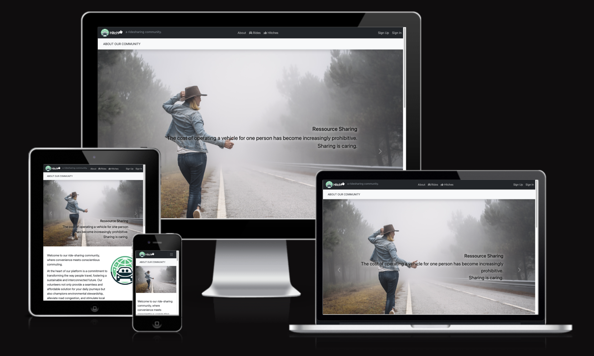

# HITCH - A Ridesharing Community

Find it on GitHub: <a href="https://github.com/A-Hoenig/Hitch">HITCH</a>

## CONTENTS

<!-- TABLE OF CONTENTS -->

  
Table of Contents

  <ol>
    <li><a href="#about-the-project">About The Project</a></li>
    <li><a href="#design">Design</a></li>
    <li><a href="#technologies-used">Technologies</a></li>
    <li><a href="#the-about-page">About Page</a></li>
    <li><a href="#the-rides-page">Rides Page</a></li>
    <li><a href="#the-hitches-paget">Hitches Page</a></li>
    <li><a href="#the-message-center-page">Message Page</a></li>
    <li><a href="#the-user-admin-page">User Admin Page</a></li>
    <li><a href="#deployment">Deployment</a></li>
    <li><a href="#future-development">Future Development</a></li>
    <li><a href="#license">License</a></li>
    <li><a href="#credits">Credits</a></li>
    <li><a href="#testing">Testing</a></li>
    <li><a href="#contact">Contact</a></li>
    <li><a href="#acknowledgments">Acknowledgments</a></li>
  </ol>

### Built With
* [https://www.gitpod.io/](GitPod)

<!-- ABOUT THE PROJECT -->
## About The Project

* Hitch is a web based app that enables likeminded travellers to connect and offer to share each other's rides
* The mindest is that when sharing available transportation, we reduce the number of vehicles on the road 
* This is not just economical, but also helps reduce road congestion leading to fewer traffic jams
* Less cars on the road of course also helps out the environment, especially in cities with large population densities
* We can all do our part to help reduce carbon emissions and leave this world a little better than when we found it

The app connects drivers and 'Hitchers' in localised regions. A Trip is made up of a Ride and a Hitch. The driver offers a ride and a hitcher Hitches a ride .. just like in real life on the roadside.

Regions can be set up by a community that is interconnected and will help connect neigbors and fellow community members that need a ride somewhere. While the app could theoretically be used to connect and share long distance trips, the main benefit lies in sharing small but frequent trips such as regular shopping runs, work commutes or sport workouts etc.

When a driver offer to give rides, he can publish it as a single or recurring event letting users know that he is offering multiple hitch opportunities. Also they can specify whether it is a one way trip, of if it will return at a later time.

* Available Rides are listed in chronological order showing the next ride happening in the selected region
* If someone wants to hitch a ride, they can select the interested ride, and request to join it - a message can also be passed
* Driver and Hitchers can communicate via message inside the app and do not need to share personal information such as address, telephone or email unless they offer to do so
* A rating system will be implemented to allow drivers and passengers to give feeback and keep everybody honest and curteous
* The system is based on volunteers! no mandatory fee is implemented, however a suggested tip will be calculated to help the driver with the operating costs of their vehicle

### Agile Developement
Agile design thinking was adopted to react to changes in design and ideas as the deveoplment process evolved. For this, Git hub Kanban boards in the project section were used to keep track of user stories and milestones as well as the progress and acceptance criteria for having achieved a specific feature in the application. The project KANBAN board is set to public and can be accessed here:
<a href="https://github.com/users/A-Hoenig/projects/4/views/1?visibleFields=%5B%22Title%22%2C%22Assignees%22%2C%22Status%22%2C%22Labels%22%2C%22Milestone%22%5D">Hitch Project KANBAN</a>

A fourth column was included to track features that would be added to a future development cycle. For the purpose of a single person development team in a very limited amount of time, the overall design was made to think of a real world fully functioning app, however, only a subset of features was possible to implement.

## Data Models / Database Design
The Database Model is shown below. For initial functionality, many options can be edited by the superuser. In future some modification will be neccessary to maintain the database when cascade delete events might permanently delete records of interest.

For instance the user model will cascade delete. Since multpile users can be linked to a single trip (Driver and Hitchers) if one of the users deletes their profile, the cascade will delete all trips they were associated with, also removing the event from other passenger, - still valid users who might need access to previous events. For this reason, cascade delete was avoided where possible... When a user account is deleted, all instances of that users database record will eventually have to be replaced with a generic palceholder to maintain the integrity of the all linked tables via foreignkeys.

For the initial 'proof of concept' this was not fully implemented yet.

(<a href="#contents">back to top</a>)

## Design

Bootstrap offers very modern and well designed web elements that were extensively used throughout this project.
The main design choice was the use of **accordion style lists** that allow a consolidated list for quick review, and then allow a user to expand each line to see more details on any trip they might be interested in.

An initial wirframe was setup to derive the basic layput of the elements and decide on the optimum information density for give realestate.

### Wireframe Mockups

In order to maximise information presented on a mobile first design philosophy, the site uses easy to recognize symbols to graphically convey facts about each trip these include:

* Number of spots still available
* The direction and frequency of the trip (one way, return, single or regular)
* Vehicle Type
* Location Type, ie. Reststop, Busstop, Address etc
* Electric vehicle for envoronmentally conscious users
* Smoking or non-smoking
* The purpose of the trip / main destination ie Shopping, Outting, Gym etc
* Message details

To speed up the user learning curve, most symbols have mouse over tool tips to explain their meaning
This can be seen below:

### The Final Design Details

### User feedback
Throughout the application, the built in messaging feature of Django was used to relay message to the user. This was implemented in a bottstrap alert that is built into the navigation header and therefore available on all subpages. The message times out after 5 seconds and is removed. Several massages can be stacked underneath each other if needed.

(<a href="#contents">back to top</a>)

## The About Page

The about page offers a pleasant welcome and explains the mission. An easy to navigate NAV bar shows the options on the site.
**Your Trips** and the **Gear Icon** are user spcific and only displayed after a user is logged on.

## The Rides Page

This page is the first point of contact with the ride sharing world. Upcoming offered rides are listed in order of date and time and summarise the Trip using graphical symbols. The page is fully responsive using Bootstrap's extensive built-in media queries. 

For mobile first philisophy, all views were generated to optimize UX/UI on phones.

### The Rides page features a prominent **Call to Action** button to encourage the user to sign up or offer a ride.

Alternate screen sizes shown below:

### Clicking on any ride will accordion expand the line to reveal the full details of the trip:

Dynamic buttons change based on the status of the ride in relation to the logged in user these are:

* Not logged in yet -> 

* Logged in Request a ride -> 

* Already Requested this ride -> 

* You are driver of ride -> 

(<a href="#contents">back to top</a>)

## The Hitches Page

The Hitches page is not yet implemented in this iteration. In principle it will be almost identical to the rides page, except the logic is reversed. If someone wihtout a car is in need of a ride somewhere they can add the requested Hitch to this page. In this case volunteers can check if there are any hitch requests published going in their direction and can offer to give them a ride. This way rides and hitches can be matched up in both directions. The database structure is already set up to handle this principle.

Rides can have many Hitch requests, and some of them will be approved=linked. (these request instances are not published and serve only to track relationships)

Hitch Requests can only have one Ride associated with them.(these ride requests will be published and are displayed on the Hitches page)

(<a href="#contents">back to top</a>)

## The Your Trips Page

This page is the management page of a user's Rides and Hitches. It displays both types of trip in chronological order with the soonest at the top of the list.

- For drivers, any rides they have offered will show any hitch requests they have received. Each request is next to a confirm button, with which the driver can approve a hitcher. A system message is automatically generated and sent to the hitcher to let them know they are approved.

- For any hitch requests in the list, the user can see if their request is still pending or if it has been approved. Likewise they will receive a message if the driver has approved them.

- Additionally the users will have the option to delete and/or edit their trips should changes be neccessary. This is not yet fully implemented and pushed to a future iteration of the development cycle. For now minmum viable product (MVP) functionality is defined as:

> **"A user can see rides available and be put in contact with the driver. Once they are connected and can message or call each other, the purpose of the site is achieved"**

(<a href="#contents">back to top</a>)

## The Message Center Page
The message center collates all message related to a Trip and displays them in a messenger style format. It is not intended as yet another messagin app, but a single source view of all the communication that has been exchanges about a single trip at a glance. Individuals will still need to communicate directly eithe rby using the message center to exchange social media contacts or by electign to reveal your phone number.

## The User Admin Page

The user admi pag displays the extended data of the built in django user model which is used throughout. User can create accounts, log in and out, reset password and delete account all implemented thorugh the django framework securely. Additionally details needed for the Hitch application are added to this database. This includes:

 |Field|Reason|
 |:--|:---|
 |DOB|user should be over 18|
 |Drivers license date|User might decide to ride or not based on driver age/experience|
 |Gender|Females may elect not to ride with men alone|
 |Phonenumber|user can elect to hide their number or publish|

 

 The account page is a fully implemented form and the user can edit their data anytime.
 The User Profile page also has subtabs to allow the creation of favorite locations for quick access and to add a vehicle they will be using to share rides.

 Both tabs offer full CRUD functionality, where users can Create, Read, Update and Delete their data as needed. Vehicle and Location lists make use of the same accordion display where a user can see a condensed list adn then click to expand the details. In this case, the details are already in a form allowing for quick change of data.

 To offer rides a user must have at least one vehicle and 2 seperate locations that can serve as depart and destination selection.
 
(<a href="#contents">back to top</a>)

### The Vehicle SubTab
 

### The Locations SubTab
 
 

## Future Development

The real world potential is undenialble and a lot more features could be implemented to make this a truly useful community.
Most of the immediately obvious future options have been brainstomed in the <a href="https://github.com/users/A-Hoenig/projects/4/views/1?visibleFields=%5B%22Title%22%2C%22Assignees%22%2C%22Status%22%2C%22Labels%22%2C%22Milestone%22%5D">Hitch Project KANBAN</a> and can be seen in the future development column.

(<a href="#contents">back to top</a>)

## Technologies Used

* [DrawSQL](https://drawsql.app/diagrams) - Used to generate the ERD (Entity Relationship Diagram)
* [ElephantSQL](https://www.elephantsql.com/) - Free PostgreSQL Database
* [Balsamiq](https://balsamiq.com/) - Used to create wireframes and mockups.
* [Git](https://git-scm.com/) - For version control.
* [Github](https://github.com/) - To save and store the files for the website.
* [GitPod](https://gitpod.io/) - IDE used to create the site.
* [Heroku](https://www.heroku.com) - Hosts a mock CLI to run python app
* [Affinity Designer](https://affinity.serif.com/en-gb/) - To design the Hitch Logo
* [Favicon.io](https://favicon.io/) - used for generating the website favicon
* [Diffchecker](https://www.diffchecker.com/) - used for comparing the code
* [Font Awesome](https://fontawesome.com/) - for creating atractive UX with icons
* [Bootstrap5](https://getbootstrap.com/) - for adding predifined styled elements and creating responsiveness
* [PEP8 Validator](http://pep8online.com/) - used for validating the python code
* [HTML - W3C HTML Validator](https://validator.w3.org/#validate_by_uri+with_options) - used for validating the HTML
* [CSS - Jigsaw CSS Validator](https://jigsaw.w3.org/css-validator/#validate_by_uri) - used for validating the CSS
* [Chrome Del Tools](https://developer.chrome.com/docs/devtools/) - for debugging the project
* [Cloudinary](https://cloudinary.com/) - for storing static data
#### Languages:

* PYTHON / DJANGO for App Logic. HTML, CSS and JS together with Bootstrap framework.

#### Python Packages:

* asgiref
* cloudinary
* crispy-bootstrap5
* dj-database-url
* dj3-cloudinary-storage
* Django
* django-allauth
* django-bootstrap-v5
* django-ckeditor
* django-cloudinary-storage
* django-crispy-forms
* django-js-asset
* gunicorn
* httptools
* install
* jsmin
* oauthlib
* psycopg
* psycopg2
* PyJWT
* python-slugify
* python3-openid
* pytz
* requests-oauthlib
* sqlparse
* text-unidecode
* urllib3
* whitenoise

(<a href="#contents">back to top</a>)

<!-- GETTING STARTED -->
## Running the app

The finished app is hosted with HEROKU here:
**<a href="https://hitch-bef4789c03e6.herokuapp.com/">Hitch, a ride sharing community</a>**
 

## Deployment

### Deploy on Heroku
 1. Fork or Clone the repository
 
 2. Generate a requirements file of all installed python packages. 
 
  ` pip3 freeze > requirements.txt`, and a file with all requirements will be created.

 * Create .env file to store environmental variables for Cloudinary, DB URL andn SECRET KEY
   * **WARNING** ensure your .env file is added to the .git ignore file or it will be published on Git
 
 3. Setting up Heroku

    * Heroku website (https://www.heroku.com/) 
    * Login to Heroku and choose **Create App** 
    * Click **New** and **Create a new app**
    * Choose a name and select your location
    * Go to the **Resources** tab 
    * From the Resources list select **Heroku Postgres**
    * Navigate to the **Deploy** tab
    * Click on **Connect to Github** and search for your repository
    * Navigate to the **Settings** tab
    * Reveal Config Vars and add your Cloudinary, Database URL (from Heroku-Postgres) and Secret key.   
    * This project uses [ElephantSQL](https://www.elephantsql.com/). 
    * If you elect to use the same make sure you install a DB with PostgrSQL version 13 or higher.
    * Then share the DB URL same as above

4. Deployment on Heroku

    * Go to the Deploy tab.
    * Choose the main branch for deploying and enable automatic deployment 
    * Select manual deploy for building the App 
    
### How to Fork the repository
For creating a copy of the repository on your account and change it without affecting the original project, use <b>Fork</b> directly from GitHub:
- On [My Repository Page](https://github.com/A-Hoenig/Hitch), press <i>Fork</i> in the top right of the page
- A forked version of my project will appear in your repository  

### How to Clone the repository
For creating a clone of the repository on your local machine, use<b>Clone</b>:
- In my [GitHub](https://github.com/A-Hoenig/Hitch), click the green <i>Code</i> button.
- Choose from <i>HTTPS, SSH and GitClub CLI</i> format and copy (preferably <i>HTTPS</i>)
- In your <i>IDE</i> open <i>Git Bash</i>
- Enter the command <code>git clone</code> followed by the copied URL
- Your clone is created

(<a href="#contents">back to top</a>)

## Testing

The testing documentation can be found at [Testing](TESTING.MD)

## Credits

### Image sources

|Image|Source|
 |:--|:---|
 |Hitchhiker 1|https://unsplash.com/photos/person-standing-beside-road-doing-handsign-VGOiY1gZZYg|
 |Girl Hitchhiker|https://unsplash.com/photos/woman-in-blue-denim-jacket-and-blue-denim-jeans-walking-on-road-during-daytime-F017VdnVpWs|
 |Inside Car Picture|https://unsplash.com/photos/man-driving-car-during-golden-hour-IAc1x02D9K0|
 |Map with pins|https://unsplash.com/photos/world-map-with-pins-TrhLCn1abMU|
 |Car On A highway|https://www.pexels.com/de-de/foto/autos-voraus-auf-der-strasse-593172/|

### Code Help

|Code|Source|
 |:--|:---|
 |Generic User Profile Page|https://www.bootdey.com/snippets/view/bs5-edit-profile-account-details|
 |GIJGO JQuery Bootstrap timepicker (not used yet)|https://gijgo.com/datetimepicker/example/bootstrap-5|
 |Online CSS grid practice|https://grid.layoutit.com/|
 |Django Tutorial|https://docs.djangoproject.com/en/5.0/intro/tutorial01/|
 |Django Tutorial for Beginners|https://www.youtube.com/watch?v=SLTXTG6ZXIM&list=PLNgB0BBP9Z8ow4juNxe5EnNtJqFglWHa0&index=4|
 |Django Forms and Crispy Forms Tutorial|https://www.youtube.com/watch?v=8xb9s3jnRF8|
 |Django Full Stack Development Udemy|https://www.udemy.com/course/full-stack-web-development-using-django/learn/lecture/41067332?start=255#overview|
 |Django Explined in 8 Minutes|https://www.youtube.com/watch?v=0sMtoedWaf0|
 |Django Chat Room|https://www.youtube.com/watch?v=Rv6gkYcN88Q|
 |CodeInstitute Django Blog|https://codeinstitute.net/de/?nab=0|

### Research Help

* Google / Stackoverflow / Redit / Bootstrap Docs / Django Docs

## License

 
 
This project is license free and part of Code Institute Full Stack Developer Course.
It is for educational use only.

<!-- CONTACT -->
## Contact

Alex Hönig -  LimeyDeveloper@pm.me

Project Link: [HITCH](https://github.com/A-Hoenig/Hitch)

## Acknowledgments

I would like to acknowledge the following people:

* Jubril Akolade - My Code Institute Mentor for the guidance.

(<a href="#contents">back to top</a>)
