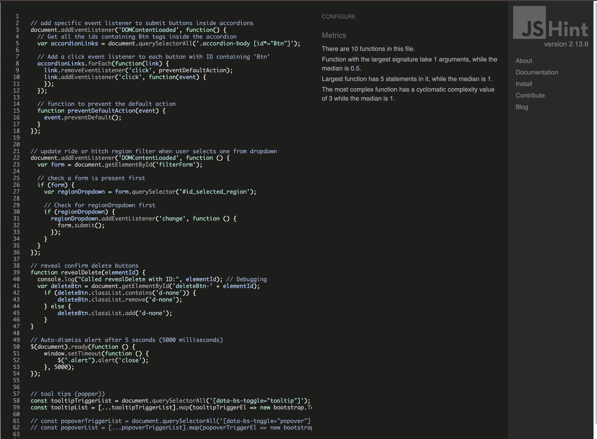
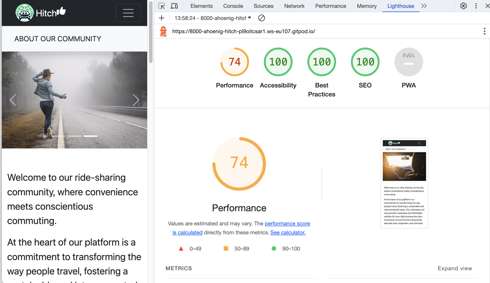
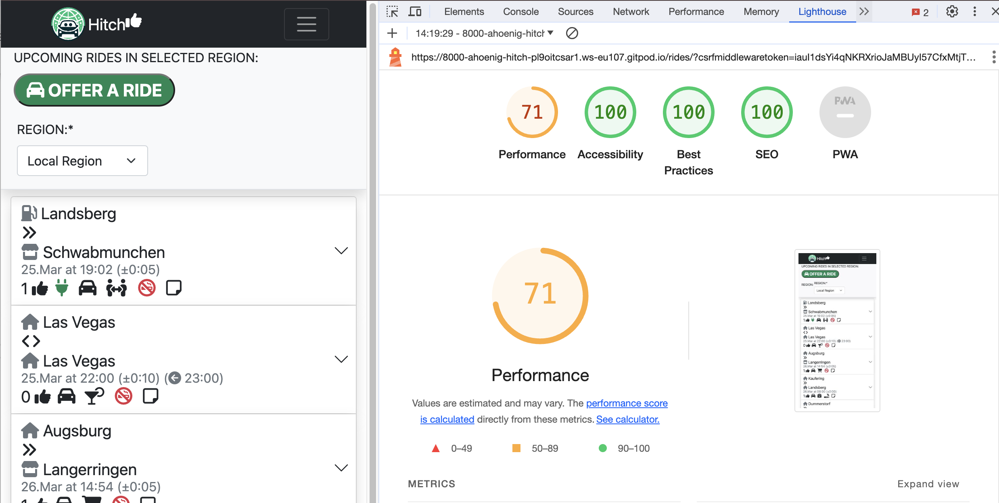
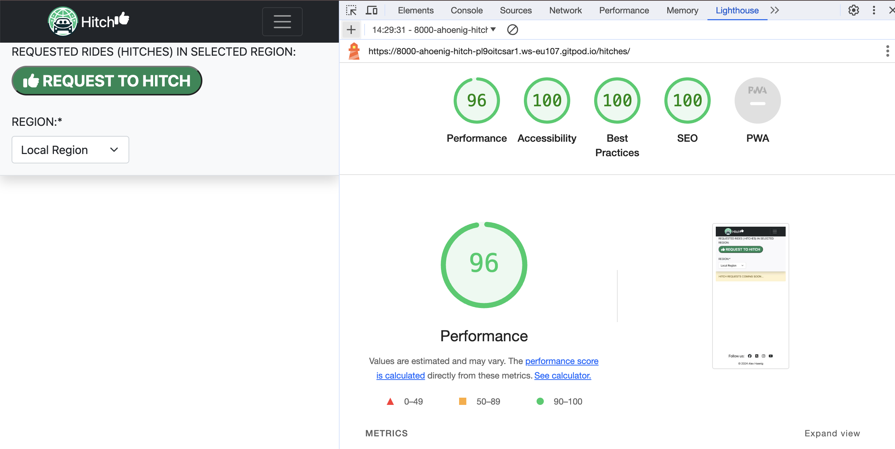
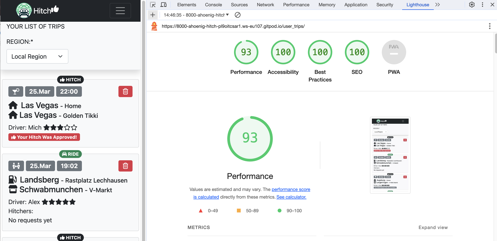
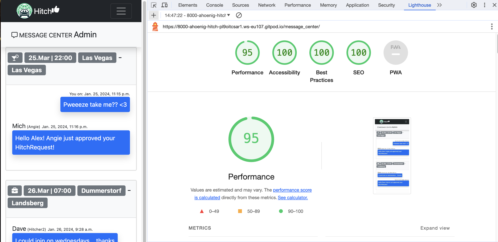

# HITCH - A Ridesharing Community

Find it on GitHub: <a href="https://github.com/A-Hoenig/Hitch">HITCH</a>

# CONTENTS

<!-- TABLE OF CONTENTS -->

  
Table of Contents

  <ol>
    <li><a href="#validator-testing">Validator Testing</a></li>
    <li><a href="#manual-testing">Manual Testing</a></li>
    <li><a href="#known-bugs">Known Bugs</a></li>
  </ol>

# Epics and User Stories

For simplicity, the App design was divided into 3 major Epics

* Admin
* Ride Sharing
* Messaging

**Admin** By using Django framework, most of the admin would be taken care of by the built in user models and account handling. Only the extended user data had to be integrated to allow tracking of information for the Ride sharing specifically.

**Ride Shring**
All user stories relating to hitching a ride with another driver fall under this category.

**Messaging**
Once Admin and Ride Sharing were accomplished an additional layer of in app messaging became possible.

# Validator Testing

## 1. W3C HTML Validator
It is a known issue that the W3C Validator does not recognise django template language (DTL) and flags it as an error.
The focus was on finding any HTML errors and bad badpractices AROUND the DTL issues.
All HTML files for the project pass W3C Validator (with the noted exceptions).

**About**

**Rides**

(<a href="#contents">back to top</a>)

**Hitches**

**User_Profile**

(<a href="#contents">back to top</a>)

**Vehicles**

(<a href="#contents">back to top</a>)

**Locations**

**Messages**

(<a href="#contents">back to top</a>)

## 2. Jigsaw CSS Validator

The project makes maximum use of Bootstrap framwwork classes. Only minimal custom CSS was use to acheive specific non-standard styling.

(<a href="#contents">back to top</a>)

## 3. PEP8 Python Validator

 - No errors were returned when passing through the official [CI pep8 Linter](https://pep8ci.herokuapp.com/)

**admin.py**

**models.py**

**forms.py**

**views.py**

(<a href="#contents">back to top</a>)

## 3. JSHint Javascript Validator

 - no errors were returned when passing through  [JSHint Validator](https://jshint.com/)

(<a href="#contents">back to top</a>)

## 4. Chrome DEV Tools Lighthouse

Code was inspected and tested through Chrome lighthouse and all pages returned acceptable scores. Changes were made where neccessary to achieve 100% accessibility for screen readers and graphics contrast.

The default bootstrap colors did cause some issues in the your trips page where even large type with color primary on a grey background was being flagged as having not enough contrast. The use of color to highight important information in an eyecatching way and subdue less important infos was therefore not possible in this context.

Text is shown mostly black to satisfy accessibility suggestions.

 

 

 

 

 

# Manual Testing

Since this app is based on interaction between users/drivers and hitchers at its core, the relevant displays and interaction based on user type and request needs to be tested.

Essentially there are 4 types of user / visitor to the website.

1. Unregistered visitor - can see the about page, visit the Ride and Hitch page to view upcoming trip and is directed to sign up if interested
2. Registered user interested in giving a ride (Driver)
3. Registered user interested in hitching a ride (Hitcher)
4. Admin user - direct db access for setting up a new Region, deleteing users and data care

For testing purposes 4 drivers and 3 Hitcher accounts have been created that can interact with each other. All accounts except Admin have the same Password to ease switching between accounts and verifying app logic and correect display. Admin and User password have been provided elsewhere.

## Users:
| User       | Role | PW |
| :-------------- |:------ | :------ |
|Admin|Admin|AdminPW|
|Angie|Driver/Hitcher|StandardPW|
|Driver1|Driver/Hitcher|StandardPW|
|Driver2|Driver/Hitcher|StandardPW|
|Hitcher1|Hitcher Only|StandardPW|
|Hitcher2|Hitcher Only|StandardPW|
|Hitcher3|Hitcher Only|StandardPW|
|Visitor|Internet browser|No PW|

## Admin Epic

### 1. GENERAL TESTS
| Feature/Story       | Action | Result |
| :-------------- |:------ | :------ |
|Visitor can see site but not logged in only pages|Enter Your_Trip, Message, User_profile URLs in browser directly|user is directed to sign in/up page|
|Visitor can create profile and is automatically signed in|click signup and enter data|account created and redirect to about page logged in. Nav bar shows restricted pages|
|User can sign out of page|click signout button in nav bar on user only page|user signed out and redirected to about page. Nav bar hides restricted pages|
|User can enter personal data on new profile|on user profile add data and click UPDATE DATA|Data is saved with user feedback given|
|User age is displayed once birthday is entered|Enter valid birthday|No age is shown. After entry correct age is calculated and added to name|
|User must be 18 to have drivers license|Enter a date < 18 years after birthday|Form gives feedback of min age|
|Data Verification in Account Details form|enter wrong date|Field is highlighted, entry not accepted|
|Data Verification in Account Details form|enter 2 letter surname|Field is highlighted, entry not accepted (min 3 letters)|
|Data Verification in Account Details form|enter #$%#^Eewe surname|Field is highlighted, entry not accepted (alphanumerics only)|
|Required fields are marked as mantatory|Omit data entry on *Fields|User feedback given before submitting form|
|User can change password|Click change Password Link|User redirected to Django password reset standard template|

### 2. MENU TESTS
| Feature/Story       | Action | Result |
| :-------------- |:------ | :------ |
|Main Menu displays correct in CLI|start app|Verified OK|

### 3. LOGIN / USER ACCOUNT TESTS
| Feature/Story       | Action | Result |
| :-------------- |:------ | :------ |
|User can create an account (Signup)|input dummy user and pw|Verified OK|
|User can log in (sign In)||
|||

### 4. UI/UX TESTS
| Feature/Story       | Action | Result |
| :-------------- |:------ | :------ |
||||
||||

### 5. CRUD
| Feature/Story       | Action | Result |
| :-------------- |:------ | :------ |
||||
||||

(<a href="#contents">back to top</a>)

### Browser Compatibility

The deployed app on heroku was tested on most popular browsers for functionality:
* Chrome
* Safari
* Edge
* Opera

## Known Bugs

<!-- CONTACT -->
## Contact

Alex Hönig -  LimeyDeveloper@pm.me

## Acknowledgments

I would like to acknowledge the following people:

* Jubril Akolade - My Code Institute Mentor for the guidance.

(<a href="#contents">back to top</a>)
