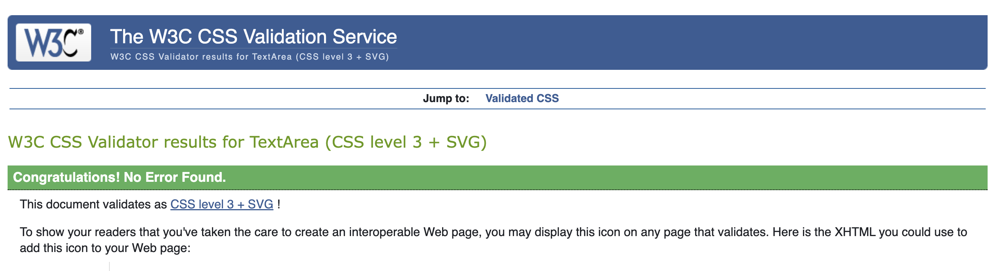

# HITCH - A Ridesharing Community

Find it on GitHub: <a href="https://github.com/A-Hoenig/Hitch">HITCH</a>

# CONTENTS

<!-- TABLE OF CONTENTS -->

  
Table of Contents

  <ol>
    <li><a href="#validator-testing">Validator Testing</a></li>
    <li><a href="#manual-testing">Manual Testing</a></li>
    <li><a href="#known-bugs">Known Bugs</a></li>
  </ol>

# Epics and User Stories

For simplicity, the App design was divided into 3 major Epics

* Admin
* Ride Sharing
* Messaging

**Admin** By using Django framework, most of the admin would be taken care of by the built in user models and account handling
Only the extended user data had to be integrated to allow tracking of information for the Ride sharing specifically.

**Ride Shring**
All user stories relating to hitching a ride with another driver fall under this category.

**Messaging**
Once Admin and Ride Sharing were accomplihed an additional layer of in app messaging became possible.

# Validator Testing

## W3C HTML Validator
It is a known issue that the W3C Validator does not recognise django template language (DTL) and flags it as an error.
The focus was on finding any HTML errors and bad badpractices AROUND the DTL issues.
All HTML files for the project pass W3C Validator (with the noted exceptions).

**About**

**Rides**

**Hitches**

**User_Profile**

**Vehicles**

**Locations**

**Messages**

## Jigsaw CSS Validator

The project makes maximum use of Bootstrap framwwork classes. Only minimal custom CSS was use to acheive specific non-standard styling.

## PEP8 Python Validator

 - No errors were returned when passing through the official [CI pep8 Linter](https://pep8ci.herokuapp.com/)

**admin.py**

**models.py**

**forms.py**

**views.py**

## Chrome DEV Tools Lighthouse

EPICS 
Hitch A Ride
Messaging
Admin

# Manual Testing

## Admin Epic

### 1. GENERAL TESTS
| Feature/Story       | Action | Result |
| :-------------- |:------ | :------ |
|a|b|c|

### 2. MENU TESTS
| Feature/Story       | Action | Result |
| :-------------- |:------ | :------ |
|Main Menu displays correct in CLI|start app|Verified OK|

### 3. LOGIN / USER ACCOUNT TESTS
| Feature/Story       | Action | Result |
| :-------------- |:------ | :------ |
|User can log in|input dummy user and pw|Verified OK|
|Password entry is checked|typed correct and wrong pw|Verified OK|
|Wrong password x3 = back to menu|type 3 wrong pw|Verified OK|
|Password blank entry rejected|Type enter without text|Verified OK|
|User recognized|logged in correectly|Verified OK|
|Username validation rejects special characters|input @$_ etc|Verified OK|
|Unreconized User triggers 'create new'|typed a new username|Verified OK|
|New user can enter password|new user name + password input|Verified OK|
|New password is checked matching|typed wrong and correct repeat pw|Verified OK|
|Feedback given to user|typed all options|Verified OK|
|User can create a new profile|select 8 and chose user+PW|Verified OK|
|New user name checked available|input known and unknown name|Verified OK|

### 4. SITE INTERACTION TESTS
| Feature/Story       | Action | Result |
| :-------------- |:------ | :------ |
||||
||||

### 5. CRUD
| Feature/Story       | Action | Result |
| :-------------- |:------ | :------ |
||||
||||

### Browser Compatibility

The deployed app on heroku was tested on most popular browsers for functionality:
* Chrome
* Safari
* Edge
* Opera

## Known Bugs

<!-- CONTACT -->
## Contact

Alex Hönig -  LimeyDeveloper@pm.me

## Acknowledgments

I would like to acknowledge the following people:

* Jubril Akolade - My Code Institute Mentor for the guidance.

(<a href="#contents">back to top</a>)
