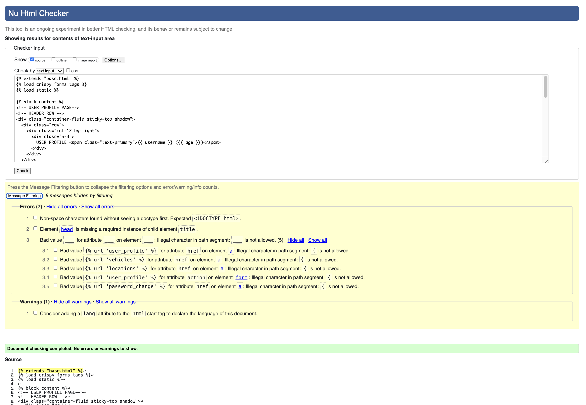
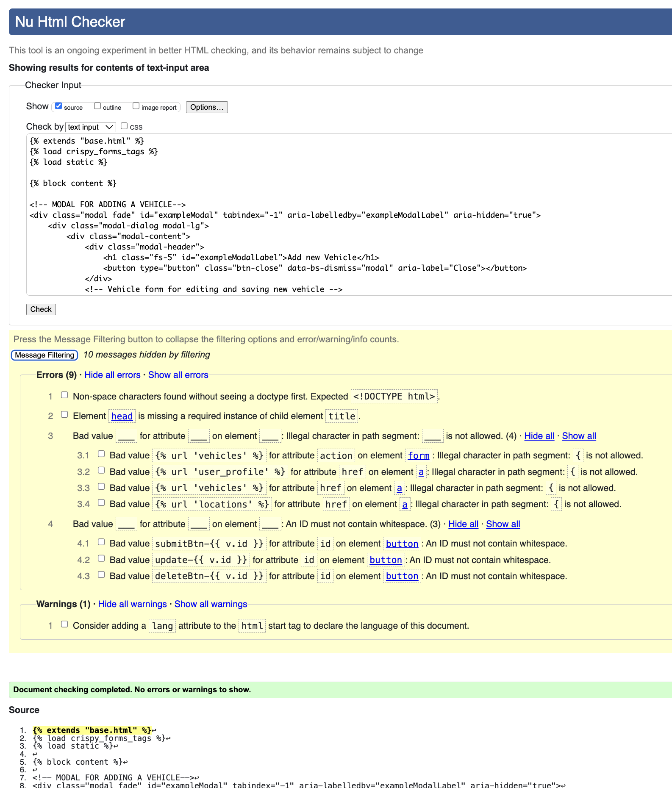

# HITCH - A Ridesharing Community

Find it on GitHub: <a href="https://github.com/A-Hoenig/Hitch">HITCH</a>

# CONTENTS

<!-- TABLE OF CONTENTS -->

  
Table of Contents

  <ol>
    <li><a href="#validator-testing">Validator Testing</a></li>
    <li><a href="#manual-testing">Manual Testing</a></li>
    <li><a href="#known-bugs">Known Bugs</a></li>
  </ol>

# Epics and User Stories

For simplicity, the App design was divided into 3 major Epics

* Admin
* Ride Sharing
* Messaging

**Admin** By using Django framework, most of the admin would be taken care of by the built in user models and account handling. Only the extended user data had to be integrated to allow tracking of information for the Ride sharing specifically.

**Ride Shring**
All user stories relating to hitching a ride with another driver fall under this category.

**Messaging**
Once Admin and Ride Sharing were accomplished an additional layer of in app messaging became possible.

# Validator Testing

## 1. W3C HTML Validator
It is a known issue that the W3C Validator does not recognise django template language (DTL) and flags it as an error.
The focus was on finding any HTML errors and bad badpractices AROUND the DTL issues.
All HTML files for the project pass W3C Validator (with the noted exceptions).

**About**

**Rides**

(<a href="#contents">back to top</a>)

**Hitches**

**User_Profile**

(<a href="#contents">back to top</a>)

**Vehicles**

(<a href="#contents">back to top</a>)

**Locations**

**Messages**

(<a href="#contents">back to top</a>)

## 2. Jigsaw CSS Validator

The project makes maximum use of Bootstrap framwwork classes. Only minimal custom CSS was use to acheive specific non-standard styling.

(<a href="#contents">back to top</a>)

## 3. PEP8 Python Validator

 - No errors were returned when passing through the official [CI pep8 Linter](https://pep8ci.herokuapp.com/)

**admin.py**

**models.py**

**forms.py**

**views.py**

(<a href="#contents">back to top</a>)

## 3. JSHint Javascript Validator

 - no errors were returned when passing through  [JSHint Validator](https://jshint.com/)

(<a href="#contents">back to top</a>)

## 4. Chrome DEV Tools Lighthouse

Code was inspected and tested through Chrome lighthouse and all pages returned acceptable scores. Changes were made where neccessary to achieve 100% accessibility for screen readers and graphics contrast.

The default bootstrap colors did cause some issues in the your trips page where even large type with color primary on a grey background was being flagged as having not enough contrast. The use of color to highight important information in an eyecatching way and subdue less important infos was therefore not possible in this context.

Text is shown mostly black to satisfy accessibility suggestions.

 

 

 

 

 

# Manual Testing

Since this app is based on interaction between users/drivers and hitchers at its core, the relevant displays and interaction based on user type and request needs to be tested.

Essentially there are 4 types of user / visitor to the website.

1. Unregistered visitor - can see the about page, visit the Ride and Hitch page to view upcoming trip and is directed to sign up if interested
2. Registered user interested in giving a ride (Driver)
3. Registered user interested in hitching a ride (Hitcher)
4. Admin user - direct db access for setting up a new Region, deleteing users and data care

For testing purposes 4 drivers and 3 Hitcher accounts have been created that can interact with each other. All accounts except Admin have the same Password to ease switching between accounts and verifying app logic and correect display. Admin and User password have been provided elsewhere.

## Users:
| User| Role | PW |
| :--- |:--- | :--- |
|Admin|Admin|AdminPW|
|Angie|Driver/Hitcher|StandardPW|
|Driver1|Driver/Hitcher|StandardPW|
|Driver2|Driver/Hitcher|StandardPW|
|Hitcher1|Hitcher Only|StandardPW|
|Hitcher2|Hitcher Only|StandardPW|
|Hitcher3|Hitcher Only|StandardPW|
|Visitor|Internet browser|No PW|

## Admin Epic

### 1. USER_PROFILE TESTS
| Feature/Story| Action | Result |
| :---|:--- | :--- |
|Visitor can see site but not logged in only pages|Enter Your_Trip, Message, User_profile URLs in browser directly|user is directed to sign in/up page|
|Logged in user can see additional pages|signin|Your Trips, Message, User Name and Gear Icon visible|
|Visitor can create profile and is automatically signed in|click signup and enter data|account created and redirect to about page logged in. Nav bar shows restricted pages|
|User can sign out of page|click signout button in nav bar on user only page|user signed out and redirected to about page. Nav bar hides restricted pages|
|User can enter personal data on new profile|on user profile add data and click UPDATE DATA|Data is saved with user feedback given|
|User age is displayed once birthday is entered|Enter valid birthday|**did not work initially** - fixed now: No age is shown. After entry correct age is calculated and added to name|
|User must be 18 to have drivers license|Enter a date < 18 years after birthday|**did not work initially** - fixed now: Form gives feedback of min age|
|Data Verification in Account Details form|enter wrong date|Field is highlighted, entry not accepted|
|Data Verification in Account Details form|enter 2 letter surname|Field is highlighted, entry not accepted (min 3 letters)|
|Data Verification in Account Details form|enter #$%#^Eewe surname|Field is highlighted, entry not accepted (alphanumerics only)|
|Data Verification in Account Details form|enter wrong phone number std|**did not work initially** - fixed now: Field is highlighted, entry not accepted (phone format only per regex)|
|Required fields are marked as mantatory|Omit data entry on *Fields|User feedback given before submitting form|
|User can change password|Click change Password Link|User redirected to Django password reset standard template| 

### 2. USERPROFILE / VEHICLE TESTS
| Feature/Story| Action | Result |
| :---|:--- | :--- |
|User can switch to Vehicle tab in user profile|Click on Vehicle Tab|Vehicle List Displayed|
|If user has no cars, a reminder is visible|Check page with new profile|No vehicles message is displayed|
|User can click button to add vehicle|Click ADD VEHICLE button|Add Vehicle Userform is shown in modal|
|User can add vehicle information|Fill out form for car data|Form is submitted and vehicle added to list|
|User can edit vehicle information|Click on vehicle row|Form is shown in dropdown with vehicle data|
|User can delete vehicle information|Click on vehicle row and then delete button|Confirmation is shown and vehicle entry is deleted|
|Required fields are marked as mantatory|Leave Make & model Blank|rejected with please fill in this field|
|Data Verification in Vehicle Form|enter maxpax < 0|rejected with must be equal or greater 0|
|Delete action requires confirmation|press delete button|confirm delete button is shown|
|User recieves feeback on CRUD operations|add, modify and delete records|feedback is shown correctly to user|
|CRUD operations work as expected|add, modify and delete records|logged on to admin page and verified DB is accurate with changes|
|Vehicle Icon changes based on type|Change vehicle to different types|Symbol changes as expected|
|Vehicle list filter|Select ALL|all vehicles shown|
|Vehicle list filter|change status of vehicle to Not Active and selecte inactive filter|Only Inactive vehicles shown|
|Vehicle list filter|select Active button filter|only Active vehicles shown|

(<a href="#contents">back to top</a>)

### 3. USERPROFILE / LOCATION TESTS
| Feature/Story| Action | Result |
| :--- |:---| :---|
|User can switch to Location tab in user profile|Click on Loction Tab|Location List Displayed|
|If user has no locations, a reminder is visible|Check page with new profile or delete all locations|No locations message is displayed|
|User can click button to add location|Click Add New Location button|Add Location Userform is shown in modal|
|User can add location information|Fill out form for location data|Form is submitted and location added to list|
|User can edit location information|Click on location row|Form is shown in dropdown with location data|
|User can delete location information|Click on location row and then delete button|Confirmation is shown and location entry is deleted|
|Required fields are marked as mantatory|Leave *Fields Blank|rejected with please fill in this field|
|User recieves feeback on CRUD operations|add, modify and delete records|feedback is shown correctly to user|
|CRUD operations work as expected|add, modify and delete records|logged on to admin page and verified DB is accurate with changes|
|Delete action requires confirmation|press delete button|confirm delete button is shown|
|Data Verification in Location Form|enter maxpax < 0|rejected with must be equal or greater 0|
|Location Icon changes based on stop_type|Change location to different stop_types|Symbol changes as expected|

(<a href="#contents">back to top</a>)

### 4. ABOUT PAGE
| Feature/Story| Action | Result |
| :--- |:--- | :--- |
|About page is shown as landing page|enter blank URL|About page is shown|
|About page is displayed|click on About link in Nav bar|About page shown as expected|
|About page content carousell works|3 main hero images cycle automatically|verified|
|About page content carousell nav arrows work|click on left-right arrows to switch image|verified|
|Text Displayed correctly|---|verified|

(<a href="#contents">back to top</a>)

### 5. RIDES PAGE & UI/UX
| Feature/Story| Action | Result |
| :---|:--- | :--- |
|Rides page is shown|Click on Rides link in Nav Bar|Rides Page loads as expected|
|User feedback bar is shown|----|verified|
|Call to action button changes based on login status|signin signout|changes from START HERE to OFFER A RIDE as expected|
|Region Filter form is displayed with first db entry as default|---|verified|
|Available rides shown in chronological order|--- |verified|
|Available rides shown in selected region|change region filter|rides list updates|
|Rides on same day or nextday date shown as TODAY or TOMORROW|Input rides with appropriate date from today|verified|
|Rides depart&destination shown with correct stop_type symbol|input many different locations|verified|
|Ride direction arrows correctly show type of trip|enter one way, return, single and multiple rides|verified|
|Ride depart time shown in correct time format|---|verified|
|Ride depart time-window shown correctly|crete rides with different time windows|verified|
|Number of remaining hitch slots shown correctly|add hitchers to ride|difference to max hitcher and actual hitchers correctly calculated|
|Electric vehicle symbol shown|check rides with Electric or Hybrid Motors|Shown where expected|
|Vehicle symbol shown based on type|check rides with different vehicle types|Shown as expected|
|Ride purpose symbol is shown|Check rides with varying trip purpose|expected symbols shown|
|Ride displays smoking status|Check rides with varying vehicles|appropriate symbol shown based on vehicle selected|
|If ride has a driver message, msg symbol shows|check message symbol on rides with a note|correctly shows and mouse over shows message|
|Mouse over tool tips show correct message|Hover over all symbols|appropriate message is correctly shown|
|UX: Accordion list works as expected|click on different rides|Detail pane opens and closes as expected for only one ride at a time|
|Clicking Request a ride button opens a message form modal with destination title|click REQUEST RIDE|verified|
|Clicking request ride creates ride request and message|click REQUEST RIDE|verified in DB hitchrequest and message correctly generated|
|Clicking OFFER A RIDE shows Offer Ride Form Modal|click OFFER A RIDE|verified|
|**Offer ride form** - Depart Date default is Today|----|verified|
|**Offer ride form** - Depart Time default is 30 minutes from NOW|----|verified|
|**Offer ride form** - Depart window default is 5min|----|verified|
|**Offer ride form** - Depart Direction default is One way|----|verified|
|**Offer ride form** - Recurring default is No|----|verified|
|**Offer ride form** - Vehicle default is First car in users list|----|verified|
|**Offer ride form** - Vehicle drop down only shows users active cars|----|**this did not work in test**. form was modifed and now verified|
|**Offer ride form** - Depart Dropdown only shows user locations|----|verified|
|**Offer ride form** -Destination Dropdown only shows user locations|----|verified|
||||
||||
||||

(<a href="#contents">back to top</a>)

#### RIDE DETAIL VIEW
| Feature/Story| Action | Result |
| :--- |:--- |:--- |
|From Address correctly shown|compare location db data|correct address for location shown|
|To Address correctly shown|compare location db data|correct address for location shown|
|Vehicle Data correctly shown|compare trip vehicle with db|correct vehicle data shown|
|Driver Telephone Shown if profile set accordingly|check user with /without contactable set|number displays or not as expected|
|Driver username or first name shown|check ride from users with without first name set|Either option displays as expected|
|Driver rating is displayed|Check different drivers and comapre DB|star rating for driver average rating in DB correctly shown|
|List of hitchers is displayed for each ride|compare rides with different hitch status|confirmed hitchers displayed by name|
|List of hitchers is displayed for each ride|compare rides with different hitch status|non confirmed hitchers calculated correctly|
|List of hitchers is displayed for each ride|compare rides with different hitch status|confirmed hitchers displayed with username or first name|
|List of hitchers is displayed for each ride|compare rides with different hitch status|confirmed hitchers displayed with hitch thumb icon|
|List of hitchers is displayed for each ride|compare rides with different hitch status|confirmed hitchers displayed with correct star rating based on average hitch rating in DB|
|'No requests' shown if no more hitch requests for ride|compare rides with different hitch status|verified|
|Drivers message is displayed if note is filled out|Create different rides with whith note|Displayed where expected|
|Recurring trips show weekdays in green|creat trips with/without recurring and different days selected|displayed only when recurring = true and days as expected|
|Request to Hitch a ride button shown|logged in and not driver|shows correctly|
|This is your ride button shown|logged in and driver|shows correctly|
|You already requested a ride button shown|logged in and hitch request sent|shows correctly|
|Sign Up to request a ride|Sign out and select a ride|shows correctly|

(<a href="#contents">back to top</a>)

#### UI/UX
| Feature/Story| Action | Result |
| :--- |:--- |:--- |
|site is responsive|change screen size in browser window|ride lines reshape as expected on smaller screens|
|site is responsive|change screen size in browser window|nav bar reshapes as expected on smaller screens|
|site is responsive|change screen size in browser window|detail view reshapes as expected on smaller screens|
|site is responsive|nav bar scrolls but user bar with region and button sticky on top|verified as expected on scroll|

(<a href="#contents">back to top</a>)

### 6. HITCHES DETAIL VIEW
| Feature/Story| Action | Result |
| :--- |:--- |:--- |
|Hitches page loads correctly|click on Hitches link in nav bar|page loads correctly|
|User feedback bar is shown|----|verified|
|Call to action button changes based on login status|signin / signout|changes from START HERE to REQUEST TO HITCH as expected|
|Region Filter form is displayed with first db entry as default|---|verified|
|System message Hitch Rides comming soon is displayed|Click on Hithches link|verified|

**Rest of Hitches page is part of next iteration**

### 7. YOUR TRIPS VIEW
| Feature/Story| Action | Result |
| :--- |:--- |:--- |
|Your trips page loads correctly|click on Hitches link in nav bar when logged in|page loads correctly|
|User feedback bar is shown|bar shows 'your list of trips'|verified|
|Region Filter form is displayed with first db entry as default|---|verified|||||
|User Rides or Hitches displayed in a list|created Rides and Hitch requests|verified|
|Rides corrctly lists all ride and hitchers the user has add or requested|create muktiple rides and request hitches|as expectd|
|Rides are correctly labelled|compare rides vs hitches|both correctly labelled|
|A trip (ride or hitch) shows type icon date and time in top row|----|verified|
|A trip shows departure and destination cities with label|----|verified|
|A ride with no hitch requests shows 'No requests yet'|----|verified|
|The Driver of the trip is shown with first or username|compare various trips|names displayed as expected|
|The Driver of the trip displays accurate rating|compare displayed against DB values|verified|
|Hitches show a pending message if it is not yet approved|compare approved vs non approved hitches|displayed with req date es expected|
|Approved hitches show a message|compare approved vs non approved hitches|Your Hitch was approved displays as expected|
|Rides with a pending hitch request show a list of hitchers|compare rides with hitch requests|verified|
|Hitcher names in request list show first name or username|----|verified|
|Hitcher names in request show star rating based on average hitcher rating|----|verified|
|Hitcher Names in request show a message button after star rating|----|verified|
|Unapproved Hitchers have a CONFIRM button next to their name|check ride with unapproved hitch requests|verified|
|Clicking CONFIRM button reveals an are you sure confirmation|click confirm button|verified|
|Clicking are you sure button creates Hitch request for that ride|click sure button and check DB|as expected|
|Confirming a hitcher gives user feedback|click sure button|displays as expected|
|Confirming a hitcher creates message to the correcet hitcher|click sure button and check DB|message from to and content created as expected|
|Confirming a hitcher removes buttons and displays a thumbs up|click sure button|as expected|
|Clicking message button next to a hitcher opens message form and displays recipient|click message button|verified|
|Typing a message to a hitcher and clicking send|click button and type message|works as expected|
|Sending a message successfully is confirmed to the user|create a message|displayed as expected|
|Sent message is created and saved in DB|crest a message and check DB|verified|
|Clicking the trashcan icon on a trip reveals a confirm button|click trashcan|button shows as expected|

### Browser Compatibility

The deployed app on heroku was tested on most popular browsers for functionality:
* Chrome
* Safari
* Edge
* Opera

## Known Bugs

<!-- CONTACT -->
## Contact

Alex Hönig -  LimeyDeveloper@pm.me

## Acknowledgments

I would like to acknowledge the following people:

* Jubril Akolade - My Code Institute Mentor for the guidance.

(<a href="#contents">back to top</a>)
